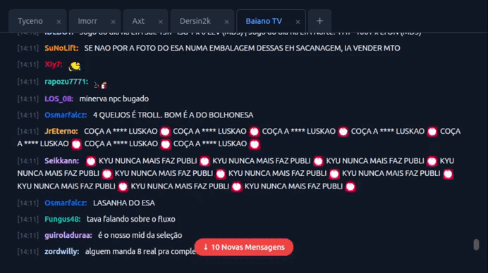

# T ChaT 💬

Um cliente de chat para a plataforma de lives [kick](https://kick.com/) para desktop/mobile leve e performático construído com Tauri, Rust e Svelte 5. Este projeto foi desenvolvido como uma exploração de tecnologias modernas para criar uma experiência de usuário fluida e eficiente em recursos.



## 🚀 Principais Funcionalidades

O TChaT não é apenas uma interface de chat, mas uma aplicação completa com funcionalidades pensadas para performance e usabilidade:

* **Interface com Abas Múltiplas:** Conecte-se a múltiplos canais de chat simultaneamente, cada um em sua própria aba.
* **Abas Reordenáveis:** Organize suas conversas arrastando e soltando as abas na ordem que preferir.
* **Persistência de Sessão:** As abas que você deixa abertas são salvas e recarregadas automaticamente quando você inicia o aplicativo novamente.
* **Conexão WebSocket Eficiente:** Utiliza uma única conexão WebSocket para todos os canais, economizando recursos de rede e memória. As inscrições nos canais são feitas dinamicamente sobre esta conexão.
* **Histórico de Mensagens Local:** As mensagens são salvas em um banco de dados SQLite local, permitindo o acesso ao histórico mesmo após reiniciar o app.
* **Scroll Inteligente:**
  * ~~A lista de mensagens é **virtualizada**, garantindo performance excepcional e baixo uso de memória, mesmo com dezenas de milhares de mensagens no histórico.~~
  * O scroll é automático, mas para de forma inteligente quando o usuário rola para cima para ler mensagens antigas.
  * Um botão de "Novas Mensagens" aparece com um contador dinâmico que diminui à medida que as mensagens são visualizadas.
* **Design Responsivo e Moderno:** A interface é limpa, utiliza um tema escuro e se adapta a diferentes tamanhos de janela.

## 🛠️ Tecnologias Utilizadas

Este projeto combina o poder do Rust no backend com a reatividade moderna do Svelte 5 no frontend.

### Backend (Rust)

* **[Tauri](https://tauri.app/)**: Framework principal para a construção do aplicativo desktop.
* **[Rust](https://www.rust-lang.org/)**: Linguagem de programação que garante performance e segurança.
* **[Tokio](https://tokio.rs/)**: Runtime assíncrono para gerenciar as tarefas de rede (WebSocket).
* **[SQLx](https://github.com/launchbadge/sqlx)**: Toolkit SQL para comunicação segura e assíncrona com o banco de dados.
* **[tokio-tungstenite](https://github.com/snapview/tokio-tungstenite)**: Biblioteca para a conexão WebSocket.
* **[Tauri Store Plugin](https://github.com/tauri-apps/tauri-plugin-store)**: Para salvar o estado das abas em um arquivo.

#### Frontend (Svelte 5)

* **[Svelte 5 (Runes)](https://svelte.dev/)**: Framework reativo para a construção da interface.
* **[TypeScript](https://www.typescriptlang.org/)**: Para um código mais seguro e manutenível.
* **[Svelte Virtual List](https://github.com/sveltejs/svelte-virtual-list)**: Componente para a virtualização da lista de mensagens.
* **CSS puro**: Para estilização.

## ⚙️ Como Começar

Para rodar este projeto localmente, você precisará ter o [ambiente de desenvolvimento do Tauri](https://tauri.app/v1/guides/getting-started/prerequisites) configurado (Rust e Node.js).

1. **Clone o repositório:**

    ```bash
    git clone https://github.com/Ricardtds/TChaT
    cd TChaT
    ```

2. **Instale as dependências do frontend:**

    ```bash
    npm install
    ```

3. **Execute em modo de desenvolvimento:**

    ```bash
    npm run tauri dev
    ```

## 📦 Compilando para Produção

Para gerar o executável final para a sua plataforma (Windows, macOS ou Linux):

```bash
npm run tauri build
```

O executável e o instalador serão gerados em `src-tauri/target/release/`.

## 📂 Estrutura do Projeto

``` tree
.
├── src/                      # Código do Frontend (SvelteKit)
│   ├── lib/components/
│   │   └── ChatTab.svelte    # Componente que renderiza um chat individual
│   └── routes/
│       └── +page.svelte      # Componente principal que gerencia as abas
├── src-tauri/                # Código do Backend (Rust)
│   ├── migrations/           # Arquivos .sql para o banco de dados
│   ├── src/
│   │   ├── commands.rs       # Funções expostas para o frontend
│   │   ├── lib.rs            # Ponto de entrada da aplicação Rust
│   │   └── models.rs         # Estruturas de dados
│   └── Cargo.toml            # Dependências do Rust
└── ...
```

---

## **[➡️ Acesse o Roadmap do TChaT Aqui](https://github.com/Ricardtds/TChaT)**

### 🔄 Nosso Fluxo de Trabalho (Workflow)

O quadro é organizado nas seguintes colunas, representando o ciclo de vida de cada tarefa:

* **📥 Backlog / Ideias:** Novas ideias, sugestões de funcionalidades e tarefas ainda não priorizadas. É aqui que tudo começa.
* **📝 A Fazer (To Do):** Tarefas que foram aprovadas, refinadas e estão prontas para serem desenvolvidas na próxima iteração.
* **👨‍💻 Em Andamento (In Progress):** Tarefas que um contribuidor já está desenvolvendo ativamente.
* **🔍 Em Revisão (In Review):** O desenvolvimento foi concluído e a tarefa está aguardando revisão de código (Code Review) através de um Pull Request.
* **✅ Concluído (Done):** A tarefa foi revisada, aprovada, e o código foi integrado à base principal.

## 🤝 Como Contribuir

Sua ajuda é muito bem-vinda! A melhor maneira de contribuir é através das Issues do GitHub.

* **🐞 Reportar um Bug:** Encontrou um problema? [**Abra uma nova Issue**](https://github.com/Ricardtds/TChaT/issues/new/choose) usando o template de "Bug Report".
* **💡 Sugerir uma Funcionalidade:** Tem uma ideia incrível? [**Abra uma nova Issue**](https://github.com/Ricardtds/TChaT/issues/new/choose) usando o template de "Feature Request".

As Issues aprovadas serão convertidas em cartões no nosso backlog para serem priorizadas.

Se você deseja trabalhar em uma tarefa existente:

1. Encontre um cartão na coluna **"A Fazer"** que lhe interesse.
2. Comente no cartão ou na Issue associada para que possamos atribuí-la a você.
3. Mova o cartão para **"Em Andamento"**.
4. Crie um Pull Request quando o trabalho estiver pronto e mova o cartão para **"Em Revisão"**.

### 🗺️ Roadmap de Alto Nível

Abaixo estão algumas das grandes funcionalidades que planejamos para o futuro do TChaT. Você pode encontrar os cartões detalhados para cada uma em nosso Kanban.

* [ ] **Notificações Nativas:** Alertas de novas mensagens quando o app estiver em segundo plano.
* [ ] **Configurações do Usuário:** Uma tela para customizar a aparência e o comportamento do app.
* [ ] **Busca no Histórico:** Ferramenta para pesquisar mensagens antigas.
* [ ] **Auto-Update:** Implementar o atualizador do Tauri para novas versões.

## 📄 Licença

Este projeto ainda está de forma privada e portanto nenhuma licença foi atribuida.
